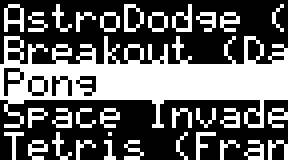

# Silicon8 for Thumby


The original [Silicon8](https://github.com/Timendus/silicon8) is an interpreter
for CHIP-8, SCHIP and XO-CHIP written in Go, and targeted mainly at WebAssembly.
This version of it is a port to MicroPython for the
[Thumby](https://thumby.us/pages/beta) playable keychain.

[CHIP-8](https://en.wikipedia.org/wiki/CHIP-8) is an interpreted programming
language, going back to the '70s. It was initially used on the COSMAC VIP and
Telmac 1800 8-bit microcomputers and was made to allow video games to be more
easily programmed for and shared among these computers. In 1990 CHIP-8 saw a
revival in the form or SCHIP on HP-48 graphing calculators, and in more recent
years the XO-CHIP extension has given it more colours, memory and better sound.
Many people still write new software for this platform, not in the least at the
yearly [Octojam](https://itch.io/jam/octojam-8).

As such, there is an impressive library of programs and games available for
CHIP-8. And we can now run almost all of them on Thumby too! 👾🕹

## Caveats and warnings

This is my first experiment with MicroPython and the Thumby, so it's probably an
inefficient mess in the eyes of a "real" MicroPython developer. But this is a
fun learning project for me 😄

There are a couple of small known issues, [see below](#known-issues) if you run into trouble.

Also, my physical Thumby keychain hasn't shipped yet, so I do not yet have
access to the real hardware. This has so far been developed using the emulator
in the [Thumby IDE](https://tinycircuits.github.io/).

## Installation

I'll request to add Silicon8 to the Thumby "Arcade" once it has been properly
tested on the physical product. You will then be able to install it with a
couple of clicks.

Untill then, you will have to manually get the MicroPython files from [this
repository](./Games/Silicon8) and put them in `/Games/Silicon8` on your Thumby
using the [Thumby IDE](https://tinycircuits.github.io/).

### Getting CHIP-8 ROMs into Silicon8 for Thumby

CHIP-8 ROMs should be placed on your Tumby in the `/Games/Silicon8/chip8`
directory. To get you started, try to copy the games in [this
repository](./Games/Silicon8/chip8) to your device!

You can put any `*.ch8` file in your CHIP-8 ROMs directory and it will be picked
up by Silicon8. If you want to, or if you need to change the controls or
interpreter type, you can add a JSON file with the same name but an added
extension `.json` (so `somegame.ch8` would become `somegame.ch8.json`) to
configure your ROM.

The JSON config file accepts this structure:

```json
{
  "name": "The Classic Game of Pong",
  "link": "https://a-link-to.some/info/if-available",
  "desc": "A short and clear description of the game and its controls",
  "type": "SCHIP",
  "keys": {
    "up": 1,
    "down": 4
  }
}
```

All fields are optional. Valid options for `type` are `AUTO` (default), `VIP`,
`SCHIP` or `XOCHIP`. Valid options for the keys are `up`, `down`, `left`,
`right`, `a` and `b` for all the buttons on the Thumby. The numeric values are
the corresponding keys to be pressed on the CHIP-8 keypad (0 - 15).

You can quit a running CHIP-8 ROM and return to the Silicon8 menu at any time by
holding down the key combination `LEFT`, `A` and `B`.

## Known issues

The interpretation of CHIP-8, SCHIP and XO-CHIP should be pretty close to the
originals. However, there are a few issues to be aware of. If you find issues
that are not described below, please [file an
issue](https://github.com/Timendus/thumby-silicon8/issues/new).

### Display limitations

Due to the small screen size and the limited colours of the Thumby, Silicon8 for
Thumby is currently limited to `lowres` mode (64x32 pixels) in monochrome. If
you use `hires` mode, the central 72x40 pixels will be shown and the rest
discarded, which doesn't make for great gameplay. When using XO-CHIP's four
colour mode, only plane 1 will be rendered to the screen.

I have some ideas on how to improve this in the future, but I will need to play
with the physical hardware first to see if those ideas are feasible.

### Sound limitations

The Thumby has a very simple speaker. The current Thumby library does not expose
this speaker in a more complicated way than setting a frequency and a duty
cycle. You can, however, bypass the library and talk to the pin directly.
Supporting the full XO-CHIP audio capabilities on this low a level will be a bit
of a chore, that I have not yet felt like doing 😄🎶

### Speed

This interpreter is not particularly fast in the Thumby emulator. I'm hoping
it's a little better on the actual hardware. If you have any ideas or
suggestions on how to boost the speed, please let me know. An issue or pull
request on this repository will get my attention.

### Type "AUTO"

Like the original Silicon8, Silicon8 for Thumby has a mode "AUTO" that tries to
auto-detect the right interpreter type. This doesn't always correctly identify
SCHIP and XO-CHIP programs when they do rely on quirks for those platforms, but
don't use any of the features of those platforms. You can easily work around
this issue by specifying the interpreter type explicitly in the JSON config
file that corresponds to your wrongly detected ROM.

## Screenshots from the emulator

 

 

 
